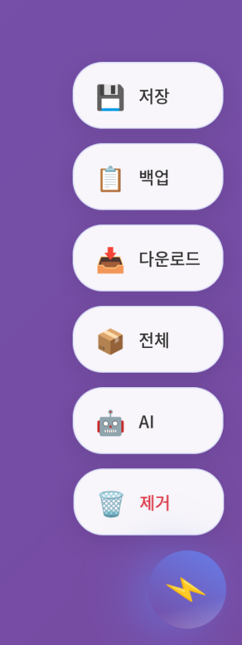

# Environment Variables Manager 🔧

웹 기반 환경변수 파일 관리 도구로, 여러 프로젝트의 .env 파일을 한 곳에서 효율적
으로 관리할 수 있습니다.


## ✨ 핵심 기능

### 📁 **다중 디렉토리 지원**

프로젝트 내외부의 모든 .env 파일을 중앙에서 관리하여 개발 환경 설정을 단순화합니
다.

### 🖥️ **웹 기반 편집**

브라우저에서 직접 환경변수를 편집할 수 있어 별도의 에디터나 터미널 명령어가 필요
하지 않습니다.

### 🔄 **자동 백업**

변경 전 자동으로 백업 파일을 생성하여 실수로 인한 데이터 손실을 방지합니다.

### 🔍 **실시간 스캔**

지정된 디렉토리에서 .env 파일을 자동으로 감지하고 관리 목록에 추가합니다.

## 🚀 주요 기능

### 📂 **파일 관리**


-   **자동 로딩**: 동일 디렉토리 내 .env 파일 자동 감지
-   **수동 추가**: 다른 디렉토리의 파일을 직접 추가
-   **디렉토리 스캔**: 전체 폴더를 스캔하여 일괄 추가
-   **드래그 앤 드롭**: 파일을 브라우저로 직접 업로드

### ✏️ **편집 기능**



-   **실시간 편집**: 환경변수 값을 즉시 수정
-   **변수 추가/삭제**: 새로운 환경변수 추가 및 기존 변수 제거
-   **자동 정규화**: 변수명을 대문자와 언더스코어로 자동 변환
-   **구문 검증**: 올바른 .env 형식 확인

### 🔒 **보안 및 백업**


-   **자동 백업**: 저장 시 타임스탬프가 포함된 백업 파일 생성
-   **수동 백업**: 언제든지 현재 상태를 백업으로 저장
-   **파일 다운로드**: 로컬 시스템으로 파일 다운로드
-   **안전한 제거**: 관리 목록에서 제거 시 원본 파일은 보존

## 🛠️ 설치 및 실행

### 📋 **시스템 요구사항**

-   Node.js 14.0 이상
-   NPM 6.0 이상
-   웹 브라우저 (Chrome, Firefox, Safari, Edge 지원)

### 1️⃣ **의존성 설치**

```bash
cd env-manager
npm install
```

### 2️⃣ **서버 실행**

```bash
# 개발 모드 (nodemon 사용)
npm run dev

# 프로덕션 모드
npm start
```

### 3️⃣ **웹 인터페이스 접속**

```
http://localhost:3001
```


## 📁 프로젝트 구조

```
env-manager/
├── server.js          # Express 서버 (API 백엔드)
├── package.json       # 프로젝트 설정 및 의존성
├── public/
│   ├── index.html     # 웹 UI (프론트엔드)
│   └── app.js         # 클라이언트 사이드 JavaScript
├── uploads/           # 업로드된 파일 임시 저장소
├── tests/             # 테스트 파일
│   ├── unit/          # 단위 테스트
│   └── integration/   # 통합 테스트
└── images/            # 스크린샷 및 문서 이미지
```

## 🔌 API 엔드포인트

### 📂 **파일 관리**

-   `GET /api/env-files` - 관리 중인 파일 목록 조회
-   `POST /api/env-files` - 새 파일을 관리 목록에 추가
-   `GET /api/env-files/:id` - 특정 파일의 내용 조회
-   `PUT /api/env-files/:id` - 파일 내용 저장 및 업데이트
-   `DELETE /api/env-files/:id` - 관리 목록에서 파일 제거

### 💾 **백업 및 다운로드**

-   `POST /api/env-files/:id/backup` - 수동 백업 생성
-   `GET /api/env-files/:id/download` - 파일 다운로드

### 🛠️ **유틸리티**

-   `POST /api/upload` - 파일 업로드 (multipart/form-data)
-   `POST /api/scan-directory` - 지정된 디렉토리에서 .env 파일 스캔


## 📖 사용법

### 🏁 **1. 초기 설정**


서버 실행 시 현재 디렉토리와 상위 디렉토리의 .env 파일을 자동으로 감지하여 관리
목록에 추가합니다.

### ➕ **2. 파일 추가 방법**


#### **수동 추가**

-   사이드바의 "📂 파일 추가" 버튼 클릭
-   파일 경로를 직접 입력하여 추가

#### **디렉토리 스캔**

-   "🔍 디렉토리 스캔" 버튼 클릭
-   지정한 폴더에서 모든 .env 파일을 자동 검색

#### **파일 업로드**

-   브라우저로 파일을 드래그 앤 드롭
-   "📤 파일 업로드" 버튼으로 파일 선택

### ✏️ **3. 환경변수 편집**


1. **파일 선택**: 왼쪽 파일 목록에서 편집할 파일 클릭
2. **변수 수정**: 오른쪽 패널에서 환경변수 값 직접 입력
3. **새 변수 추가**: "➕ 새 환경변수 추가" 버튼 사용
4. **변수 삭제**: 각 변수 옆의 삭제 버튼 클릭
5. **저장**: "💾 저장" 버튼으로 변경사항 적용

### 🔒 **4. 백업 및 보안**

-   **자동 백업**: 파일 저장 시 타임스탬프가 포함된 백업 자동 생성
-   **수동 백업**: "📋 백업" 버튼으로 현재 상태 백업
-   **파일 다운로드**: "📥 다운로드" 버튼으로 로컬 저장
-   **안전한 제거**: 관리 목록에서 제거해도 원본 파일은 보존

## 🔐 보안 고려사항

### 📁 **파일 권한**

-   서버 실행 계정에 .env 파일 읽기/쓰기 권한 필요
-   백업 파일 생성을 위한 디렉토리 쓰기 권한 확인

### 🌐 **네트워크 보안**

-   프로덕션 환경에서는 HTTPS 사용 강력 권장
-   방화벽 설정으로 접근 IP 제한
-   리버스 프록시(Nginx, Apache) 사용 권장

### 🔐 **접근 제어**

-   필요시 기본 인증(Basic Auth) 또는 JWT 토큰 인증 구현
-   환경변수 값 마스킹 기능 추가 고려
-   민감한 정보는 별도 암호화 저장 권장

## ⚠️ 제한사항

### 📄 **파일 형식**

-   .env 파일 형식만 지원 (확장자: .env, .env.\*)
-   텍스트 기반 파일만 처리 가능
-   바이너리 파일 또는 이미지 파일 불가

### 🖥️ **시스템 제약**

-   단일 서버 인스턴스에서만 동작
-   대용량 파일(10MB 이상) 처리 시 성능 저하 가능
-   동시 편집 시 충돌 가능성 (마지막 저장 우선)

### 🌍 **브라우저 호환성**

-   Internet Explorer 지원 안함
-   모바일 브라우저에서 일부 기능 제한

## 🔧 커스터마이징

### 🔌 **포트 변경**

```bash
PORT=3002 npm start
```

### 📂 **파일 필터 수정**

`server.js`의 `findEnvFiles` 메서드에서 파일명 패턴 변경:

```javascript
// 기본: .env, .env.local, .env.development 등
// 사용자 정의 패턴으로 수정 가능
const envPattern = /^\.env(\.|$)/;
```

### 🎨 **UI 테마 변경**

`public/index.html`의 CSS 변수를 수정하여 테마 커스터마이징:

```css
:root {
    --primary-color: #007bff;
    --secondary-color: #6c757d;
    --success-color: #28a745;
    --danger-color: #dc3545;
}
```

### 🔄 **자동 새로고침 간격**

파일 변경 감지 간격을 조정:

```javascript
// server.js에서 수정
const watchInterval = 1000; // 1초 (기본값)
```

## 🚀 향후 개발 계획

### ✨ **예정된 기능**

-   [ ] 다중 사용자 지원 및 권한 관리
-   [ ] 환경변수 값 암호화/복호화
-   [ ] Git 통합 (커밋 전 자동 백업)
-   [ ] 환경변수 템플릿 기능
-   [ ] RESTful API 문서화 (Swagger)
-   [ ] Docker 컨테이너 지원

### 🔄 **개선 사항**

-   [ ] 실시간 협업 편집 기능
-   [ ] 변경 이력 추적 및 비교
-   [ ] 환경변수 유효성 검사
-   [ ] 모바일 반응형 UI 개선
-   [ ] 다국어 지원 (i18n)

## 📄 라이센스

MIT License - 자세한 내용은 [LICENSE](LICENSE) 파일을 참조하세요.

## 🖼️ 스크린샷 갤러리

### 메인 대시보드


### 파일 관리 인터페이스


### 환경변수 편집기


### 백업 및 다운로드


### 설정 패널


### API 연동 예시


### 파일 업로드 기능


### 디렉토리 스캔 결과


---

**Environment Variables Manager**로 더 효율적인 개발 환경 관리를 시작하세요! 🚀
